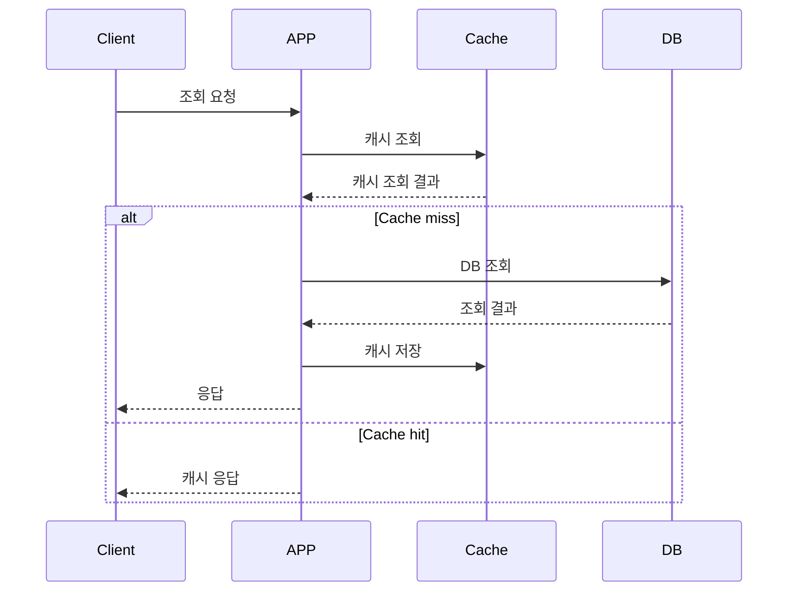

### 캐시(Cache)란?

자주 사용되는 데이터를 보관하는 임시 저장 계층으로 요청되는 정보에 빠르게 액세스할 수 있도록 하여 백엔드 서버의 부하를 줄이고, 응답 속도를 개선할 수 있습니다.

### 성능 저하가 예상되는 쿼리 분석

-   인기 상품 TOP 3

    -   현재 판매 중인 상품 중, 주어진 기간 내 가장 많이 판매된 상품을 조회하는 쿼리입니다.

    **주요 연산**

    -   order 테이블을 조회하여 상태를 확인한 후, 그룹화 및 개수 정렬 필요

    -   product 테이블과 join 하여 상품 정보 조회

    **성능 저하 가능성**

    -   추가적인 요구 사항(예: 특정 카테고리별 인기 상품 제공)이 발생할 경우 더욱 복잡해질 가능성이 높습니다.
    -   메인 화면 진입 시 필수적으로 호출되는 API이므로 사용자 접속이 증가하면 부하가 급증할 것으로 예상됩니다.

### 캐싱 전략

-   Cache-Aside 패턴 적용
    1.  클라이언트가 데이터를 요청하면 먼저 캐시에서 조회합니다.
    2.  캐시에 데이터가 없으면(Cache miss) 데이터베이스에서 조회한 후, 캐시에 저장합니다.
    3.  캐시에 데이터가 있을 경우(Cache hit), 바로 캐시에서 응답을 반환합니다.



그러나, Cache-Aside 패턴만으로는 캐시 스탬피드(Cache Stampede) 현상이 발생할 가능성이 있습니다.

### 캐시 스탬피드(Cache Stampede) 문제와 해결 방안

-   캐시 스탬피드란?
    Cache가 만료된 상태에서 대량의 요청이 동시에 발생하면, 모든 요청이 DB에 몰리게 되어 부하가 급증하고 이후 캐시에 데이터를 저장하는 과정에서도 쓰기 요청이 몰리면서 Redis에도 부하가 발생할 수 있습니다.

    | 기법                   | 설명                                                                                     | 단점                                       |
    | ---------------------- | ---------------------------------------------------------------------------------------- | ------------------------------------------ |
    | Spin Lock              | Redis Spin Lock을 이용하여 하나의 프로세스만 캐시 데이터를 갱신하도록 제한               | 캐시 업데이트 전까지 요청이 지연될 수 있음 |
    | Cache Warming          | 만료되기 전에 캐시 데이터를 미리 로드하여 Cache miss를 방지                              | TTL과 크론 실행 패턴 조정 필요             |
    | Stale-While-Revalidate | 기존 캐시 데이터를 제공하면서 백그라운드에서 최신 데이터를 갱신                          | 일시적으로 오래된 데이터가 제공될 수 있음  |
    | Write-through          | 데이터베이스에 쓰기 작업이 발생하면 캐시도 즉시 갱신                                     | 쓰기 작업 부하 증가 가능성                 |
    | PER Algorithm          | Redis 키의 만료 시간이 일정 이하로 남았을 때 확률적으로 DB에서 데이터를 읽어와 캐시 갱신 | 확률 조정이 필요                           |

### 최종 적용 방식: Cache Warming 도입

캐시 스탬피드를 방지하기 위해 Cache Warming을 적용합니다.
Cron Job을 통해 주기적으로 TTL 만료 전 인기 상품 데이터를 캐시에 미리 로드하여, 캐시 스탬피드 현상을 방지합니다.

**Cache warming 적용 코드**

```typescript
    @Cron(CronExpression.EVERY_DAY_AT_MIDNIGHT)
    async warmPopularProductsCache() {
        try {
            this.logger.log('인기 상품 캐시 워밍 시작');
            const currentDate = getPastDate(1);
            const pastDate = getPastDate(3);

            const popularProducts = await this.productRepository.findPopularProducts(
                pastDate,
                currentDate,
            );

            //스케줄러 버퍼 1시간
            const CACHE_TTL = 25 * 60 * 60 * 1000;

            await this.cacheManager.set('popular-products', popularProducts, CACHE_TTL);
            this.logger.log('인기 상품 캐시 워밍 완료');
        } catch (error) {
            this.logger.error('인기 상품 캐시 워밍 실패:', error);
        }
    }
```

**적용 방식**

-   매일 자정(Cron Expression: EVERY_DAY_AT_MIDNIGHT)에 인기 상품 데이터를 미리 캐싱
-   예기치 않은 서버 다운으로 인해 스케줄러가 지연될 경우를 대비하여 TTL을 스케줄 주기보다 길게 설정

### 결론

인기 상품 조회 API의 성능 개선을 위해 Cache-Aside 전략을 도입하고, Cache Warming 기법을 활용하여 캐시 스탬피드 문제를 방지하는 방법을 구상하였습니다.
