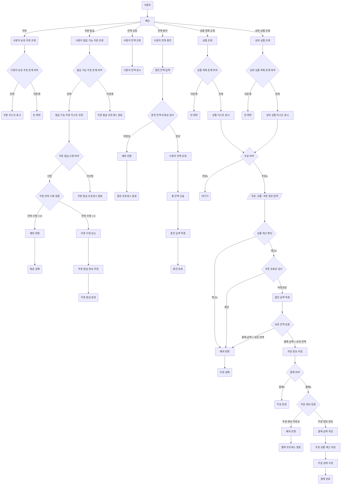

```mermaid
flowchart TD
user(사용자) --> main[메인]

%% 쿠폰 조회
main -->|쿠폰| c1(사용자 보유 쿠폰 조회)
c1 --> c2{사용자 보유 쿠폰 존재 여부}
c2 --> |존재| c3(쿠폰 리스트 표시)
c2 --> |미존재| c4(빈 화면)

%%쿠폰 발급
main -->|쿠폰 발급| cc1[사용자 발급 가능 쿠폰 조회]
cc1 --> cc2{발급 가능 쿠폰 존재 여부}
cc2 --> |존재| cc3[발급 가능 쿠폰 리스트 조회]
cc2 --> |미존재| cc4(쿠폰 발급 프로세스 종료)
cc3 --> cc5{쿠폰 발급 신청 여부}
cc5 --> |신청| cc6{쿠폰 잔여 수량 검증}
cc5 --> |미신청| cc7[쿠폰 발급 프로세스 종료]
cc6 --> |잔여 수량 > 0| cc8[쿠폰 수량 감소]
cc6 --> |잔여 수량 <=0| cc9[예외 반환]
cc9 --> cc10(발급 실패)
cc8 --> cc11[쿠폰 발급 정보 저장]
cc11 --> cc12(쿠폰 발급 완료)

%%잔액 조회
main -->|잔액 조회| b(사용자 잔액 조회)
b --> b1(사용자 잔액 표시)

%%잔액 충전
main --> |잔액 충전| bb1(사용자 잔액 충전)
bb1 --> bb2[/충전 잔액 입력/]
bb2 --> bb2.1{충전 잔액 유효성 검사}
bb2.1 --> |비정상| bb4[예외 반환]
bb4 --> bb5(충전 프로세스 종료)
bb2.1 --> |정상| bb3[사용자 잔액 조회]
bb3 --> bb6[총 잔액 산출]
bb6 --> bb7[충전 금액 적용]
bb7 --> bb8(충전 완료)

%%상품
main --> |상품 목록 조회| p1[상품 조회]
p1 --> p2{상품 목록 존재 여부}
p2 --> |미존재| p3(빈 화면)
p2 --> |존재| p4[상품 리스트 표시]

%%상위 상품
main --> |상위 상품 조회| sp1[상위 상품 조회]
sp1 --> sp2{상위 상품 목록 존재 여부}
sp2 --> |미존재| sp3(빈 화면)
sp2 --> |존재| sp4[상위 상품 리스트 표시]

%% 주문
p4 --> o{주문 여부}
sp4 --> o

o --> |주문x| o11(대기기)
o --> |주문o| o1[/주문, 상품, 쿠폰 정보 입력/]
o1 --> o2{상품 재고 확인}
o2 --> |재고x| o3[예외 반환]
o2 --> |재고o| o4{쿠폰 유효성 검사}
o4 --> |정상| o3
o4 --> |비정상상| o5(할인 금액 적용)
o5 --> o6{보유 잔액 검증}
o6 --> |결제 금액 > 보유 잔액| o3
o6 --> |결제 금액 < 보유 잔액| o7[주문 정보 저장]
o3 --> o8(주문 실패)

%% 결제
o7 --> pay1{결제 여부}
pay1 --> |결제x| o9(주문 완료)
pay1 --> |결제o| pay2{주문 정보 검증}
pay2 --> |주문 정보 비정상| pay3[예외 반환]
pay3 --> pay3.1(결제 프로세스 종료)
pay2 --> |주문 정보 정상| pay4[결제 금액 차감]
pay4 --> pay5[주문 상품 재고 차감]
pay5 --> pay6[주문 상태 수정]
pay6 --> pay7(결제 완료)
```
