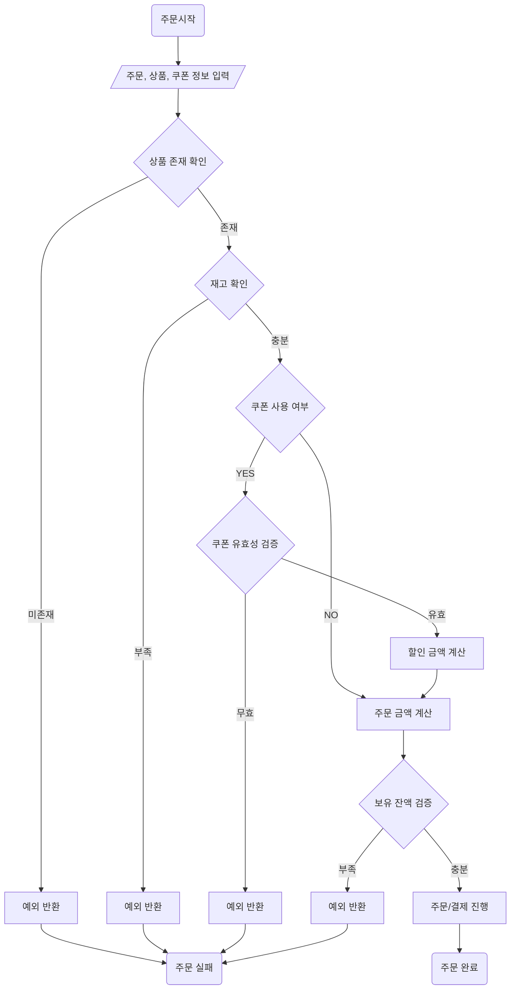
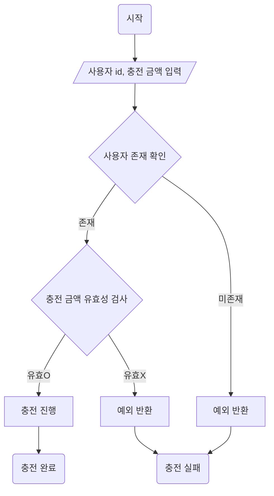
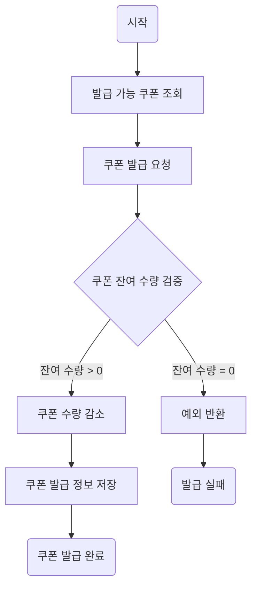

#### 주문

```mermaid
    flowchart TD
    AA(주문시작) --> BB[/주문, 상품, 쿠폰 정보 입력/]
    BB --> CC{상품 존재 확인}
    CC --> |미존재| DD[예외 반환]
    CC --> |존재| EE{재고 확인}
    EE --> |부족| FF[예외 반환]
    EE --> |충분| GG{쿠폰 사용 여부}

    GG --> |YES| HH{쿠폰 유효성 검증}
    HH --> |유효| II[할인 금액 계산]
    HH --> |무효| JJ[예외 반환]

    GG --> |NO| KK[주문 금액 계산]
    II --> KK

    KK --> LL{보유 잔액 검증}
    LL --> |부족| MM[예외 반환]
    LL --> |충분| NN[주문/결제 진행]
    NN --> UU(주문 완료)
    DD --> VV(주문 실패)
    FF --> VV
    JJ --> VV
    MM --> VV
```

#### 잔액 충전

```mermaid
    flowchart TD
    A(시작) --> B[/사용자 id, 충전 금액 입력/]
    B --> C{사용자 존재 확인}
    C --> |존재| D{충전 금액 유효성 검사}
    C --> |미존재| E[예외 반환]
    D --> |유효O| F[충전 진행]
    D --> |유효X| G[예외 반환]
    F --> O(충전 완료)
    E --> P(충전 실패)
    G --> P
```

#### 쿠폰 발급

```mermaid
    flowchart TD
    A(시작) --> B[발급 가능 쿠폰 조회]
    B --> C[쿠폰 발급 요청]
    C --> D{쿠폰 잔여 수량 검증}
    D --> |잔여 수량 = 0| F[예외 반환]
    D --> |잔여 수량 > 0| E[쿠폰 수량 감소]
    E --> G[쿠폰 발급 정보 저장]
    G --> H(쿠폰 발급 완료)
    F --> I(발급 실패)
```
