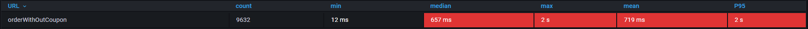

# 성능 테스트 결과 보고서

---

**경로**

- load-test

**k6 setting**

- git clone https://github.com/grafana/k6 && cd k6
- git submodule update --init

**influxdb, grafana 컨테이너화**

- docker-compose up -d influxdb grafana
- k6 run --out influxdb=http://localhost:8086 ./load-test/${script}.js

# 1. 쿠폰 발급 성능 테스트

## 1-1. 비관적 락 방식 성능 측정

**결과 요약**

<details>
  <summary>K6 지표</summary>

```plaintext

테스트 진행일: 2025-02-27 20:07:17 / 2025-02-27 20:08:40

✗ 상태 코드 정상
↳ 99% — ✓ 5112 / ✗ 10
checks.........................: 99.80% 5112 out of 5122
data_received..................: 2.0 MB 29 kB/s
data_sent......................: 1.4 MB 21 kB/s
http_req_blocked...............: avg=37.08µs min=0s med=0s max=9.7ms p(90)=0s p(95)=0s
http_req_connecting............: avg=31.41µs min=0s med=0s max=9.7ms p(90)=0s p(95)=0s
http_req_duration..............: avg=1.46s min=3.5ms med=1.25s max=3.56s p(90)=3.12s p(95)=3.26s
{ expected_response:true }...: avg=1.46s min=13.36ms med=1.25s max=3.56s p(90)=3.12s p(95)=3.26s
http_req_failed................: 0.19% 10 out of 5122
http_req_receiving.............: avg=311.01µs min=0s med=0s max=11.56ms p(90)=867.46µs p(95)=975.43µs
http_req_sending...............: avg=20.6µs min=0s med=0s max=1.52ms p(90)=0s p(95)=0s
http_req_tls_handshaking.......: avg=0s min=0s med=0s max=0s p(90)=0s p(95)=0s
http_req_waiting...............: avg=1.46s min=3.5ms med=1.25s max=3.56s p(90)=3.12s p(95)=3.26s
http_reqs......................: 5122 73.165479/s
iteration_duration.............: avg=1.46s min=3.5ms med=1.25s max=3.56s p(90)=3.12s p(95)=3.26s
iterations.....................: 5122 73.165479/s
vus............................: 1 min=1 max=250
vus_max........................: 250 min=250 max=250
running (1m10.0s), 000/250 VUs, 5122 complete and 1 interrupted iterations
contacts ✓ [======================================] 001/250 VUs 1m10s

```

</details>


- 총 요청 수: 5,122건
- 평균 응답 시간: 1.47s
- P90: 3.12s
- P95: 3.27s
- 최소: 3.51ms
- 최대: 3.56s
- 실패한 요청(10건)은 중복 요청으로 인한 충돌로 발생
- 최대 250명의 동시 사용자에 대해 초당 약 74 ~ 85건의 요청을 처리

## 1-2. 레디스 기반 비동기 방식 성능 측정

<details>
<summary>K6 지표</summary>

```plaintext

테스트 진행일: 2025-02-27 20:17:20 / 2025-02-27 20:18:39
✗ 상태 코드 정상
↳  97% — ✓ 46174 / ✗ 1139

checks.........................: 97.59% 46174 out of 47313
data_received..................: 13 MB  191 kB/s
data_sent......................: 14 MB  200 kB/s
http_req_blocked...............: avg=7.23µs   min=0s     med=0s      max=19.62ms p(90)=0s       p(95)=0s
http_req_connecting............: avg=4.63µs   min=0s     med=0s      max=19.62ms p(90)=0s       p(95)=0s
http_req_duration..............: avg=155.72ms min=1.04ms med=69.46ms max=3.3s    p(90)=152.88ms p(95)=769.59ms
{ expected_response:true }...: avg=157.39ms min=1.53ms med=69.81ms max=3.3s    p(90)=152.92ms p(95)=770.08ms
http_req_failed................: 2.40%  1139 out of 47313
http_req_receiving.............: avg=35.76µs  min=0s     med=0s      max=6.04ms  p(90)=0s       p(95)=517µs
http_req_sending...............: avg=10.68µs  min=0s     med=0s      max=2ms     p(90)=0s       p(95)=0s
http_req_tls_handshaking.......: avg=0s       min=0s     med=0s      max=0s      p(90)=0s       p(95)=0s
http_req_waiting...............: avg=155.67ms min=1.04ms med=69.4ms  max=3.3s    p(90)=152.88ms p(95)=769.58ms
http_reqs......................: 47313  675.894212/s
iteration_duration.............: avg=155.83ms min=1.53ms med=69.5ms  max=3.3s    p(90)=152.89ms p(95)=769.6ms
iterations.....................: 47313  675.894212/s
vus............................: 1      min=1              max=249
vus_max........................: 250    min=250            max=250
running (1m10.0s), 000/250 VUs, 47313 complete and 1 interrupted iterations
contacts ✓ [======================================] 001/250 VUs  1m10s

```

</details>


**결과 요약**

- 총 요청 수: 47,313건
- 평균 응답 시간: 155.72ms
- P90: 152.88ms
- P95: 769.60ms
- 최소: 1.04ms
- 최대: 3.3s
- 실패한 요청(1,139건)은 중복 요청으로 인한 충돌로 발생
- 최대 250명의 동시 사용자에 대해 초당 약 675건의 요청을 처리

## 1-3 결과 분석

| 처리방식      | 처리량 | p90      | p95      | 최대  | RPS   |
| ------------- | ------ | -------- | -------- | ----- | ----- |
| 비관적락      | 5,122  | 3.12s    | 3.26s    | 3.56s | 74~85 |
| 레디스 비동기 | 47,313 | 152.88ms | 769.59ms | 3.3s  | 675   |

1. **처리량**

    - 레디스 비동기 방식이 비관적락 대비 약 9.2배 높은 처리량 달성
    - 초당 처리건수(RPS)가 74건에서 675건으로 크게 향상

2. **응답 시간**

    - p90 기준: 3.12초 → 152.88ms로 95% 이상 개선
    - p95 기준: 3.26초 → 769.59ms로 76% 이상 개선

3. **안정성 고려사항**
    - 백그라운드 작업의 정상 처리 여부에 대한 모니터링 필요

# 2. 주문 프로세스 성능 테스트

## 2-1. 전체 주문 프로세스 성능 측정

**주문 시나리오**

1. 포인트 충전
2. 주문 요청
3. 결제 요청

<details>
  <summary>K6 지표</summary>

```plaintext

테스트 진행일: 2025-02-27 21:00:01 / 2025-02-27 21:01:22

✗ 상태 코드 정상
↳  99% — ✓ 9594 / ✗ 15
checks.........................: 99.84% 9594 out of 9609
data_received..................: 3.7 MB 53 kB/s
data_sent......................: 1.8 MB 26 kB/s
http_req_blocked...............: avg=28.81µs  min=0s      med=0s       max=14.43ms p(90)=0s      p(95)=0s
http_req_connecting............: avg=23.69µs  min=0s      med=0s       max=14.43ms p(90)=0s      p(95)=0s
http_req_duration..............: avg=899.66ms min=11.4ms  med=716.05ms max=3.89s   p(90)=2.06s   p(95)=2.43s
  { expected_response:true }...: avg=899.39ms min=11.4ms  med=715.96ms max=3.89s   p(90)=2.06s   p(95)=2.43s
http_req_failed................: 0.15%  15 out of 9609
http_req_receiving.............: avg=191.02µs min=0s      med=0s       max=4.86ms  p(90)=702.9µs p(95)=886.74µs
http_req_sending...............: avg=16.59µs  min=0s      med=0s       max=2.16ms  p(90)=0s      p(95)=0s
http_req_tls_handshaking.......: avg=0s       min=0s      med=0s       max=0s      p(90)=0s      p(95)=0s
http_req_waiting...............: avg=899.45ms min=10.64ms med=715.91ms max=3.89s   p(90)=2.06s   p(95)=2.43s
http_reqs......................: 9609   137.269202/s
iteration_duration.............: avg=2.69s    min=43.96ms med=2.42s    max=6.67s   p(90)=5.07s   p(95)=5.42s
iterations.....................: 3203   45.756401/s
vus............................: 1      min=1            max=250
vus_max........................: 250    min=250          max=250
running (1m10.0s), 000/250 VUs, 3203 complete and 0 interrupte iterations
contacts ✓ [======================================] 000/250 VUs 1m10s

```

</details>


- 총 요청 수: 8544건
- 평균 응답 시간: 894.59s
- P90: 2.06s
- P95: 2.42s
- 최소: 11.41ms
- 최대: 3.90s
- 실패한 요청(15건)은 포인트 충전 낙관적 락으로 인한 충돌로 발생
- 최대 250명의 동시 사용자에 대해 초당 약 147 ~ 167건의 요청을 처리

> 가장 성능이 저조한 주문 격리 테스트 및 로직 개선 진행

## 2-2. 주문 처리 로직 개선 비교

### 2-2-1. for문 로직(기존)

<details>
  <summary>K6 지표</summary>

```plaintext

테스트 진행일: 2025-02-27 21:12:51 / 2025-02-27 21:14:04

✓ 상태 코드 정상
checks.........................: 100.00% 8302 out of 8302
data_received..................: 3.6 MB  52 kB/s
data_sent......................: 1.8 MB  25 kB/s
http_req_blocked...............: avg=34.27µs  min=0s      med=0s       max=8.1ms  p(90)=0s       p(95)=0s
http_req_connecting............: avg=28.53µs  min=0s      med=0s       max=8.1ms  p(90)=0s       p(95)=0s
http_req_duration..............: avg=1.01s    min=10.51ms med=939.98ms max=3.83s  p(90)=1.95s    p(95)=2.29s
  { expected_response:true }...: avg=1.01s    min=10.51ms med=939.98ms max=3.83s  p(90)=1.95s    p(95)=2.29s
http_req_failed................: 0.00%   0 out of 8302
http_req_receiving.............: avg=243.16µs min=0s      med=0s       max=4.62ms p(90)=790.08µs p(95)=917.08µs
http_req_sending...............: avg=18.7µs   min=0s      med=0s       max=6.77ms p(90)=0s       p(95)=0s
http_req_tls_handshaking.......: avg=0s       min=0s      med=0s       max=0s     p(90)=0s       p(95)=0s
http_req_waiting...............: avg=1.01s    min=10.51ms med=939.81ms max=3.83s  p(90)=1.95s    p(95)=2.29s
http_reqs......................: 8302    118.597582/s
iteration_duration.............: avg=1.01s    min=10.58ms med=939.98ms max=3.83s  p(90)=1.95s    p(95)=2.29s
iterations.....................: 8302    118.597582/s
vus............................: 1       min=1            max=249
vus_max........................: 250     min=250          max=250

running (1m10.0s), 000/250 VUs, 8302 complete and 0 interrupted iterations
contacts ✓ [======================================] 000/250 VUs 1m10s

```

</details>


- 총 요청 수: 7278건
- 평균 응답 시간: 1.01s
- P90: 1.95s
- P95: 2.28s
- 최소: 10.51ms
- 최대: 3.84s
- 최대 250명의 동시 사용자에 대해 초당 약 96 ~ 128건의 요청을 처리

### 2-2-2. Promise.all 로직(개선)

<details>
  <summary>K6 지표</summary>

```plaintext

테스트 진행일: 2025-02-27 21:18:37 / 2025-02-27 21:19:57

✓ 상태 코드 정상
checks.........................: 100.00% 11480 out of 11480
data_received..................: 5.0 MB  72 kB/s
data_sent......................: 2.4 MB  35 kB/s
http_req_blocked...............: avg=13.18µs  min=0s      med=0s       max=1.54ms p(90)=0s       p(95)=0s
http_req_connecting............: avg=11.2µs   min=0s      med=0s       max=1.11ms p(90)=0s       p(95)=0s
http_req_duration..............: avg=728.97ms min=11.71ms med=668.29ms max=2.18s  p(90)=1.41s    p(95)=1.56s
{ expected_response:true }...: avg=728.97ms min=11.71ms med=668.29ms max=2.18s  p(90)=1.41s    p(95)=1.56s
http_req_failed................: 0.00%   0 out of 11480
http_req_receiving.............: avg=269.9µs  min=0s      med=0s       max=2.51ms p(90)=814.04µs p(95)=915.1µs
http_req_sending...............: avg=9.96µs   min=0s      med=0s       max=1.51ms p(90)=0s       p(95)=0s
http_req_tls_handshaking.......: avg=0s       min=0s      med=0s       max=0s     p(90)=0s       p(95)=0s
http_req_waiting...............: avg=728.69ms min=11.34ms med=668.17ms max=2.18s  p(90)=1.41s    p(95)=1.56s
http_reqs......................: 11480   163.981549/s
iteration_duration.............: avg=729.04ms min=11.71ms med=668.44ms max=2.18s  p(90)=1.41s    p(95)=1.56s
iterations.....................: 11480   163.981549/s
vus............................: 1       min=1              max=249
vus_max........................: 250     min=250            max=250
running (1m10.0s), 000/250 VUs, 11480 complete and 0 interrupted iterations
contacts ✓ [======================================] 000/250 VUs  1m10s

```

</details>




- 총 요청 수: 9632건
- 평균 응답 시간: 719.20ms
- P90: 1.41s
- P95: 1.55s
- 최소: 11.72ms
- 최대: 2.18s
- 최대 250명의 동시 사용자에 대해 초당 약 127 ~ 137건의 요청을 처리

### 2-2-3. 결과 분석

| 처리방식    | 처리량 | 평균 응답시간 | p90   | p95   | 최대  | RPS     |
| ----------- | ------ | ------------- | ----- | ----- | ----- | ------- |
| for문       | 7,278  | 1.01s         | 1.95s | 2.28s | 3.84s | 96~128  |
| Promise.all | 9,632  | 719.20ms      | 1.41s | 1.55s | 2.18s | 127~137 |

1. **처리량 (Throughput)**

    - Promise.all 방식이 for문 대비 약 32% 높은 처리량 달성
    - 초당 처리건수(RPS)가 최소 96건에서 127건으로 향상

2. **응답 시간 (Response Time)**

    - p90 기준: Promise.all이 약 28% 개선 (1.95s → 1.41s)
    - p95 기준: Promise.all이 약 32% 개선 (2.28s → 1.55s)
