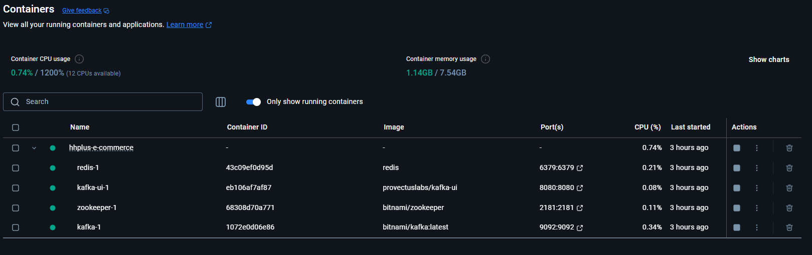
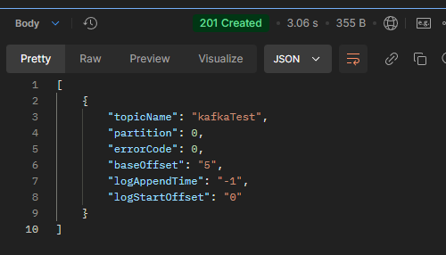
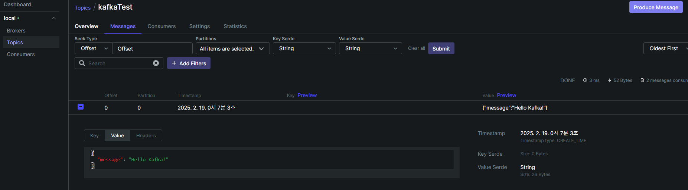

## 도커 세팅

```yaml
services:
    zookeeper:
        image: 'bitnami/zookeeper'
        ports:
            - '2181:2181'
        volumes:
            - 'zookeeper_data:/bitnami'
        environment:
            ALLOW_ANONYMOUS_LOGIN: yes
            ZOOKEEPER_CLIENT_PORT: 2181
            ZOOKEEPER_TICK_TIME: 3000

    kafka:
        image: 'bitnami/kafka:latest'
        ports:
            - '9092:9092'
        volumes:
            - 'kafka_data:/bitnami'
        depends_on:
            - zookeeper
        environment:
            KAFKA_CFG_ZOOKEEPER_CONNECT: zookeeper:2181
            KAFKA_CFG_LISTENER_SECURITY_PROTOCOL_MAP: PLAINTEXT:PLAINTEXT,PLAINTEXT_HOST:PLAINTEXT
            KAFKA_CFG_LISTENERS: PLAINTEXT://:29092,PLAINTEXT_HOST://:9092
            KAFKA_CFG_ADVERTISED_LISTENERS: PLAINTEXT://kafka:29092,PLAINTEXT_HOST://localhost:9092
            KAFKA_INTER_BROKER_LISTENER_NAME: PLAINTEXT

    kafka-ui:
        image: provectuslabs/kafka-ui
        ports:
            - '8080:8080'
        restart: always
        environment:
            KAFKA_CLUSTERS_0_NAME: local
            KAFKA_CLUSTERS_0_BOOTSTRAPSERVERS: kafka:29092
volumes:
    zookeeper_data:
        driver: local
    kafka_data:
        driver: local
```



## 카프카 라이브러리 설치

```bash
npm install @nestjs/microservices kafkajs
```

## 카프카 연결

#### AppModule

```typescript
import { ClientsModule, Transport } from '@nestjs/microservices';
import { AppController } from './app.controller';
import { AppService } from './app.service';

@Module({
    imports: [
        ClientsModule.register([
            {
                name: 'KAFKA_CLIENT',
                transport: Transport.KAFKA,
                options: {
                    client: {
                        clientId: 'nestjs',
                        brokers: ['localhost:9092'],
                    },
                    consumer: {
                        groupId: 'helloKafka',
                    },
                },
            },
        ]),
    ],
    controllers: [AppController],
    providers: [AppService],
})
export class AppModule {}
```

#### AppController

```typescript
import { Controller, Get, Inject } from '@nestjs/common';

import { AppService } from './app.service';
import { MessagePattern, Payload } from '@nestjs/microservices';

@Controller()
export class AppController {
    constructor(
        @Inject('KAFKA_CLIENT')
        private readonly appService: AppService,
    ) {}

    // 메시지 발행
    @Get('/publish')
    async publishTest() {
        this.appService.publishedMessage('Hello Kafka!');
    }

    // 메시지 수신
    @MessagePattern('kafkaTest')
    consumer(@Payload() payload) {
        return this.appService.printMessage(payload);
    }
}
```

#### AppService

```typescript
import { Inject, Injectable } from '@nestjs/common';
import { ClientKafka } from '@nestjs/microservices';

@Injectable()
export class AppService {
    constructor(
        @Inject('KAFKA_CLIENT')
        private readonly kafkaClient: ClientKafka,
    ) {}

    publishedMessage(message: string) {
        return this.kafkaClient.emit('kafkaTest', { message });
    }

    printMessage(payload) {
        console.log(JSON.stringify(payload));
        return payload;
    }
}
```

### 테스트 결과

- Publish 실행 확인
  

- Consumer 실행 확인
  

- Topic / Message 확인
  
