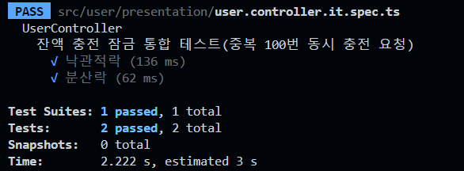
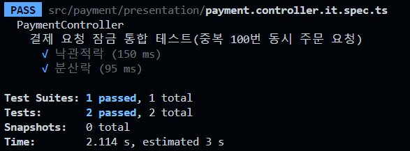
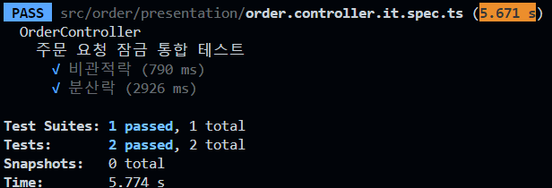
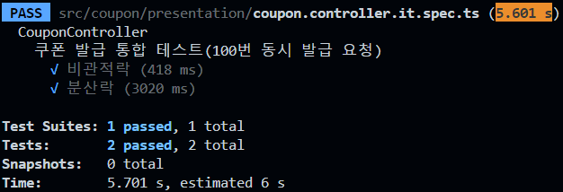

### 동시성 제어 방식

```text
각각의 비즈니스 로직에 맞는 DB Lock을 검토하고 정리하였습니다.
다음과 같은 이유로 실제 구현은 분산락으로 진행하였습니다:

- DB Lock 사용 시 경합이 강한 로직에서 DB에 부하가 심합니다.
- DB Lock 적용 시 조인 테이블이 많아짐에 따라 트랜잭션에서 데드락이 발생할 수 있습니다.
- 분산락은 분산 환경에서 공통된 락을 사용하여 순차적 처리를 보장합니다.
```

### 발생할 수 있는 동시성 이슈

#### 포인트 충전 / 포인트 차감 (결제)

-   포인트 충전과 차감의 경우 데이터 경합이 낮을 것으로 예상하였습니다.
-   중복 요청은 오류로 판단하여 한 건만 처리되는 낙관적 락이 적합하다고 판단했습니다.

**테스트 결과**

-   포인트 충전

     
    
-   포인트 차감

     

```text
동시 요청에서 Update 성공 여부로 판별하는 낙관적 락은 충돌 발생 시 필요에 따라 재시도 로직이 필요하여 구현 복잡도가 높아질 수 있습니다.
최초 잠금 획득 실패 시 종료되는 심플락의 성능이 더 우수했습니다.
```

#### 상품 재고 차감 (주문) / 선착순 쿠폰 발급

-   상품 재고 차감과 선착순 쿠폰 발급의 경우 동시 경합이 매우 빈번할 것으로 예상하였습니다.
-   재고의 데이터 정합성이 중요하며, 단일 처리가 아닌 남은 재고 수량에 따른 처리가 필요하여 비관적 락이 적합하다고 판단했습니다.

**테스트 결과**

-   상품 재고 차감

     
-   선착순 쿠폰 발급

    

```text
상품 재고 차감과 선착순 쿠폰 발급의 경우, 단일 데이터베이스에서는 락 해제 즉시 다음 트랜잭션이 실행되어
딜레이가 있는 분산락보다 성능이 우수했습니다.
분산락으로는 Redlock 라이브러리를 사용하여 재시도 횟수와 딜레이 시간 지정으로 스핀락을 구현하였으나 아래와 같은 문제가 발생하였습니다.

**문제 상황과 해결**

1. 문제점
   - 스핀락 사용 중 대기 중인 요청들이 재시도 횟수를 모두 소진하여 잠금 획득에 실패하는 현상 발생
   - 예시: 1000건의 동시 요청 중 재고가 200개인 상황에서, 150개 처리 중 나머지 850개 요청의 재시도 횟수가 소진되어 실패 처리되면서 50개의 재고가 남는 상황 발생

2. 해결 방안
   - 예상 동시 요청 수를 산정하고, 이에 맞춰 재시도 횟수와 딜레이 시간을 최적화하여 해결

**결론**
대량의 동시 요청 처리 시 스핀락은 다음과 같은 주의점이 있었습니다.
- 동시 요청 수에 비례하여 재시도 횟수가 증가하여 성능 저하 가능성
- 예상 동시 요청 수 초과 시 잠금 획득 실패 케이스 발생
- 세밀한 설정 조정 필요

이러한 한계로 인해 대량의 동시 요청이 예상되는 경우에는 Pub/Sub 패턴 도입 또는 대기열에 요청을 저장하여 순차적으로 처리하는 방식을 고려할 수 있을 것 같습니다.
```
