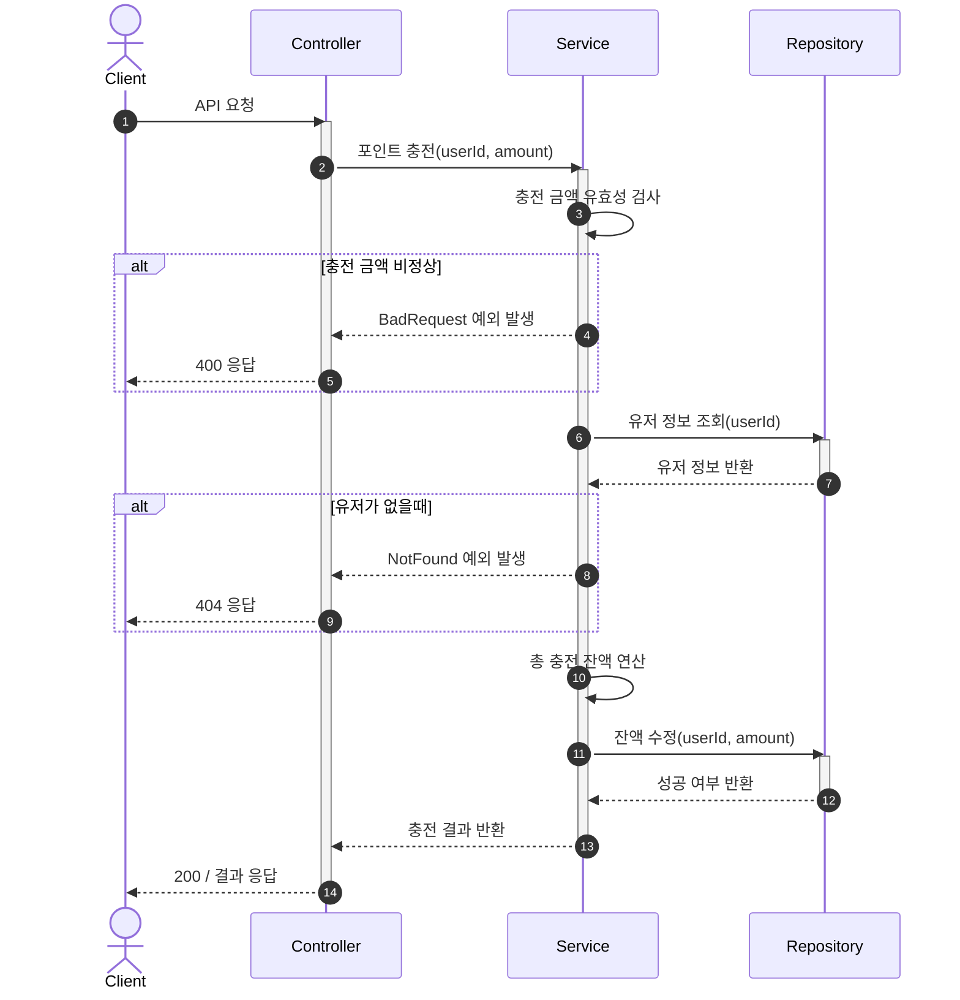
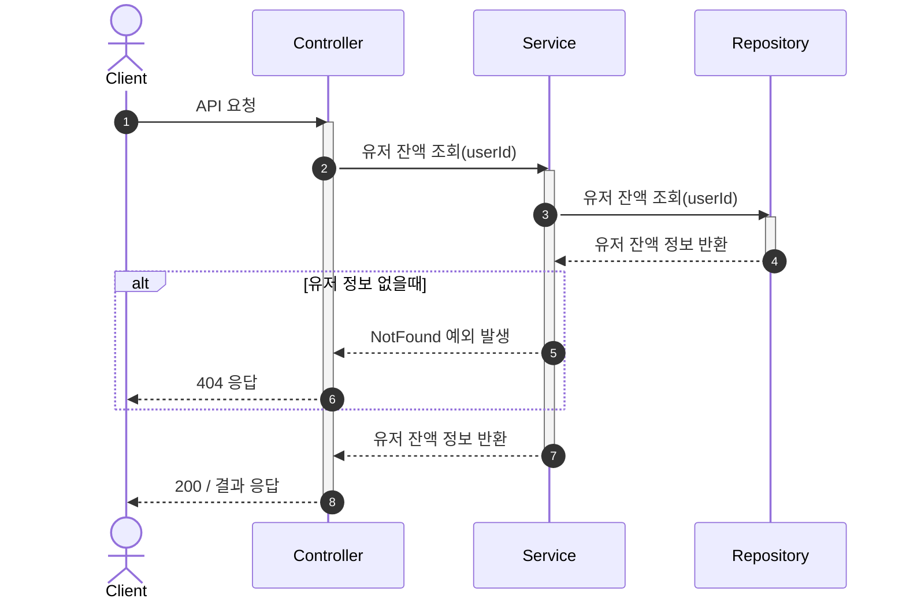
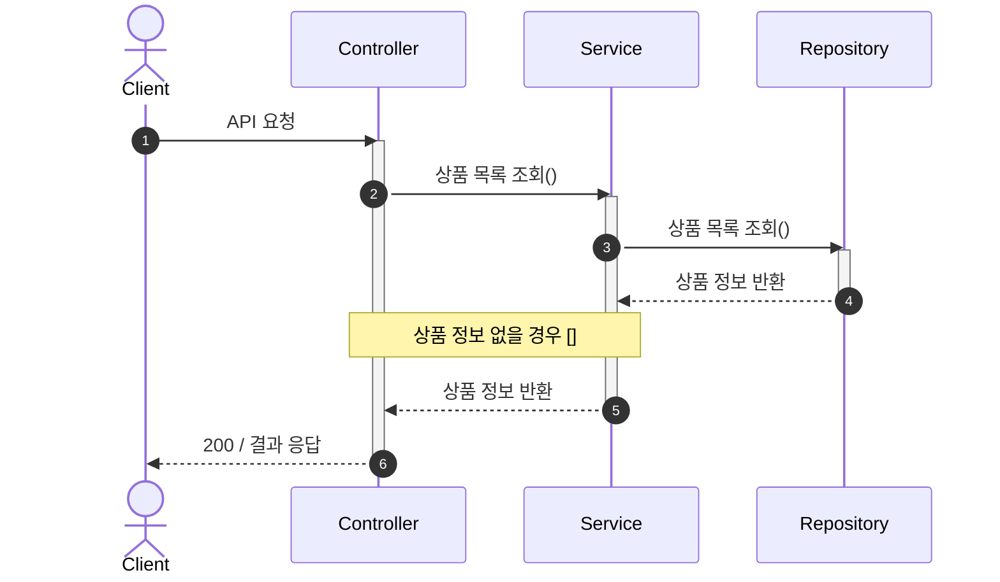
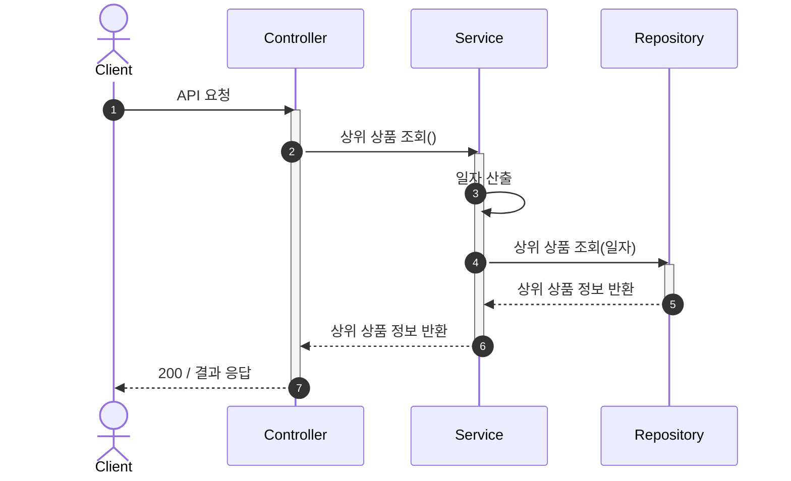
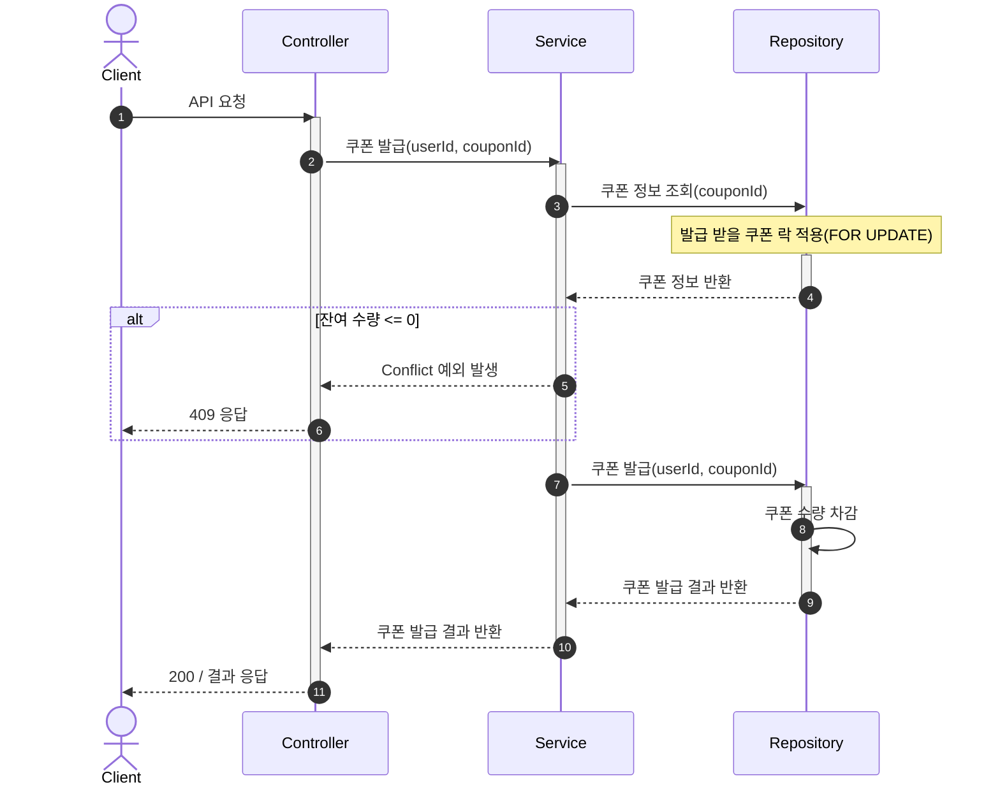
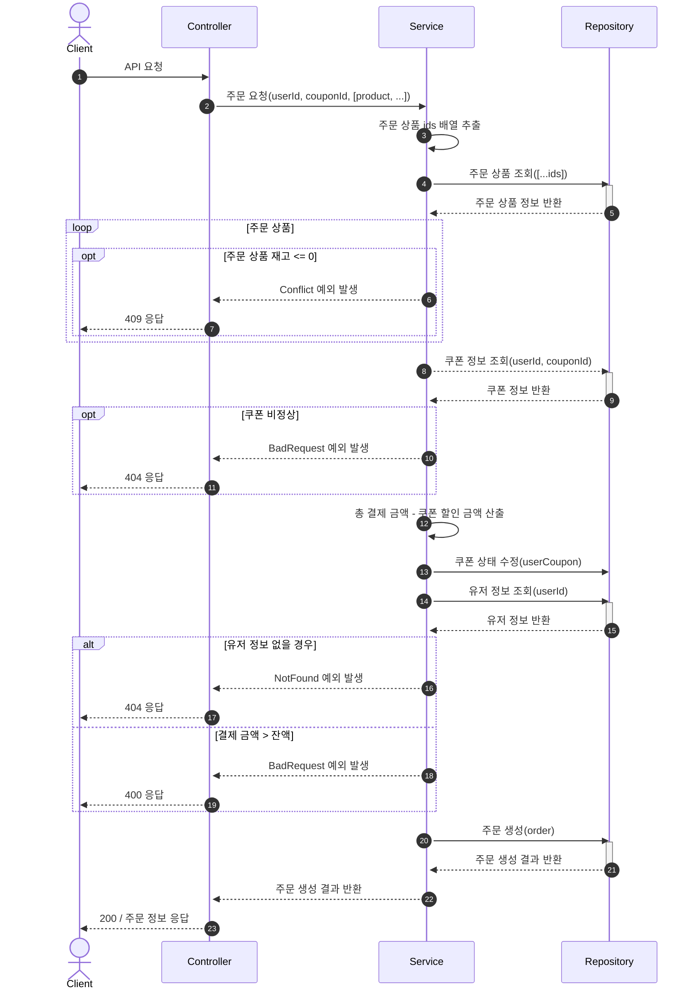
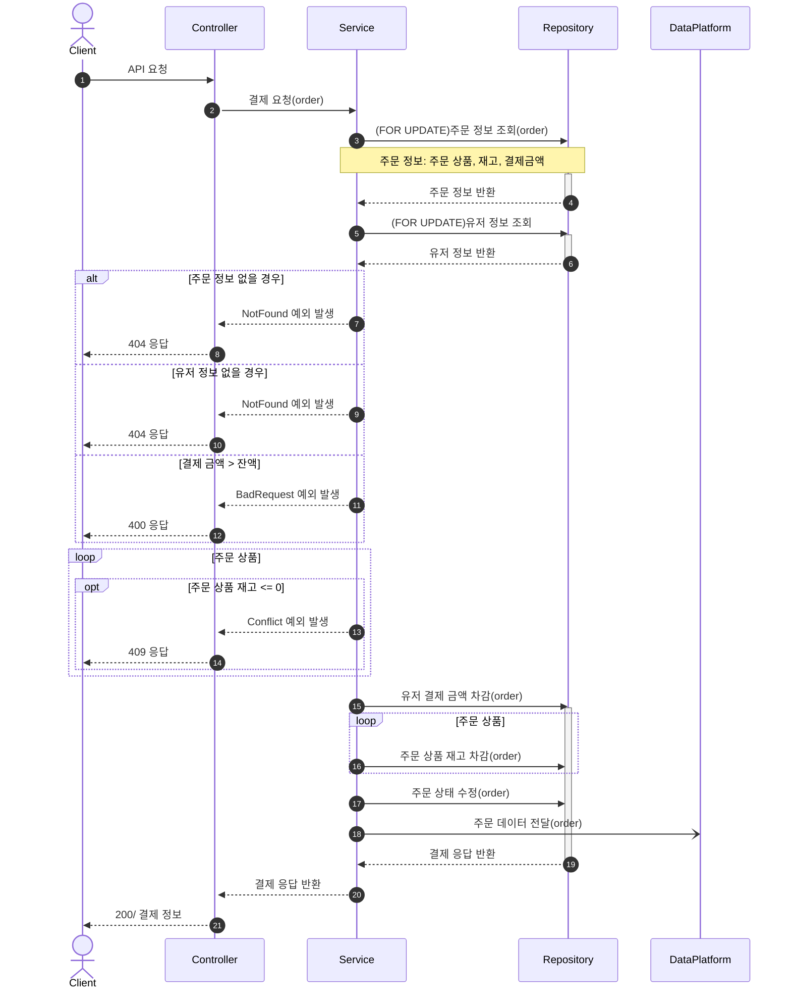

| 기호 | 선 종류             | 응답 종류 | 의미                                |
| ---- | ------------------- | --------- | ----------------------------------- |
| ->>  | 실선                | 호출      | 데이터 전달 또는 메서드 호출        |
| -->> | 점선                | 응답      | 응답, 결과 반환                     |
| -)   | 화살 끝이 열린 실선 | 호출      | 데이터 전달 또는 메서드 호출(async) |
| --)  | 화살 끝이 열린 점선 | 응답      | 응답, 결과 반환(async)              |

### 1. 잔액 충전 시퀀스 다이어그램

### 2. 잔액 조회 시퀀스 다이어 그램

### 3. 상품 조회 시퀀스 다이어그램

### 4. 상위 상품 조회 시퀀스 다이어그램

### 5. 선착순 쿠폰 발급 시퀀스 다이어그램

### 7. 상품 주문 시퀀스 다이어그램

### 8. 결제 시퀀스 다이어그램

